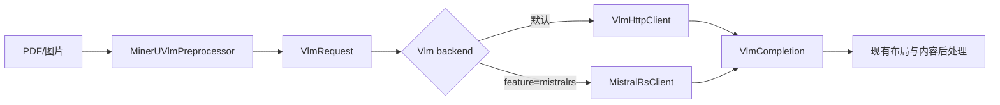

# MinerU2.5-2509-1.2B 与 mistral.rs 集成可行性调研

调研日期：2026-08-03

## 执行摘要

结论：**可行，建议进入小规模 PoC；整体风险为中等。** MinerU2.5-2509-1.2B 的配置明确声明为 `Qwen2VLForConditionalGeneration` / `qwen2_vl`，mistral.rs 0.8.1 已有对应的 Qwen2-VL loader，因此不存在基础架构不支持这一阻断项。[^model-config][^mistral-models]

最小方案是在现有官方 VLM 流程中新增可选 `mistralrs` feature 和本地 backend，继续复用 `VlmRequest`、MinerU 页面预处理及后处理，不改普通 OpenAI-compatible 路径。模型目录优先由环境变量指定；仅在显式开启自动下载且未指定目录时，才由 mistral.rs 复用 Hugging Face 缓存下载固定模型版本。

最大的不确定性不是模型能否加载，而是 mistral.rs 的图像预处理、chat template、采样和生成结果能否满足 MinerU 当前两阶段布局/内容识别协议。该项必须通过真实页面 fixture 验证，不能仅以“loader 支持 Qwen2-VL”代替结果兼容性测试。

## 1. 已核实事实

| 项目 | 结论 |
|---|---|
| 官方模型 | `opendatalab/MinerU2.5-2509-1.2B` |
| 模型架构 | `Qwen2VLForConditionalGeneration` |
| `model_type` | `qwen2_vl`，不是 `qwen2_5_vl` |
| 权重 | 单个 BF16 `model.safetensors`，约 2.31 GB，约 1.156B 参数 |
| remote code | 配置无 `auto_map`，模型仓库不依赖自定义 Python modeling 文件 |
| 模型许可 | AGPL-3.0 |
| mistral.rs | 0.8.1 支持 Qwen2-VL 和 Qwen2.5-VL，二者使用不同 loader |
| mistral.rs MSRV | 0.8.1 声明 Rust 1.88；本项目为 Rust 1.89，版本条件满足[^mistral-crate] |
| 下载权限 | 当前模型公开且非 gated；一般无需 token，但仍受网络和限流影响 |

当前 Hugging Face API 返回的模型 revision 是 `1aa090b41282e64fadd79c10572221f91ec21924`。生产环境应固定经过验证的 commit，不应长期跟随 `main`。[^model-api]

## 2. 当前仓库接入面

当前只有 `office` feature，VLM 推理通过 `reqwest` 调用 OpenAI-compatible 服务：

- `Cargo.toml:58-95`：feature 与依赖定义；尚无本地推理依赖。
- `src/vlm_types.rs:200-223`：`VlmRequest` / `VlmCompletion` 已是可复用的推理协议边界。
- `src/vlm_http.rs:78-174`：`VlmHttpClient` 同时承担 HTTP transport、模型发现和部分输入策略。
- `src/vlm_client.rs:788-794`：`MinerUVlmClient` 当前直接持有 `VlmHttpClient`。
- `src/vlm_client.rs:957-1845`：业务流程还调用 `VlmHttpClient` 的图片解码、限制、批量请求和任务租约方法，因此不能只把字段类型机械替换掉。
- `src/vlm_config.rs:43-159`：已有集中式、可测试的环境变量解析模式。
- `Dockerfile:5`：当前使用 `--features office`，尚未开启全部 feature。
- `.github/workflows/ci.yml:248-262`：Rust CI 已覆盖 `--all-features`，可作为新增 feature 的第一道编译门禁。

### 推荐边界

不要把 mistral.rs 塞进普通 `src/openai.rs` 路径。它最适合接在官方 VLM 流程：



第一版使用 feature-gated enum 即可，不需要先引入 async trait：

```rust
enum VlmBackend {
    Http(VlmHttpClient),
    #[cfg(feature = "mistralrs")]
    MistralRs(MistralRsClient),
}
```

但应把调用面限制在实际需要的操作，例如单次/批量预测、响应上限和图片准入；现有纯图片解码逻辑可保留为共享函数。只有出现第三种 backend 时，再考虑抽象 trait。

## 3. Cargo feature 与全 feature 镜像

建议只新增一个跨平台、CPU 可编译的项目 feature：

```toml
[features]
default = []
office = ["dep:office2pdf"]
mistralrs = ["dep:mistralrs"]

[dependencies]
mistralrs = { version = "=0.8.1", optional = true, default-features = false }
```

最终依赖写法应先用 `cargo metadata` 和最小编译验证确认；上例重点是保持 mistral.rs 可选、锁定已核验版本，并避免通用镜像隐式启用硬件加速 feature。

Docker 构建可按需求改为：

```dockerfile
RUN cargo build --release --locked -p mineru --all-features --bins
```

### 必须明确的限制

如果镜像必须使用 `--all-features`，**不要**再把 `cuda`、`metal`、`mkl`、`flash-attn` 映射成根项目的独立 feature。否则：

- `--all-features` 会同时开启平台互斥后端；
- Linux amd64/arm64 多架构构建可能因 Metal/CUDA 工具链失败；
- CUDA runtime 需求会污染当前 Debian 通用镜像；
- CI 的现有 `--all-features` 也会失去跨平台意义。

因此通用 release 镜像应是 **CPU 能运行的全功能镜像**。CUDA/Metal 若以后确有性能需求，应使用独立 Dockerfile/镜像变体或单独的目标平台构建，而不是纳入“全部 feature”的集合。mistral.rs 的 `flash-attn` 也不是 Qwen2-VL loader 的必要条件。[^mistral-features]

## 4. 模型加载与自动下载

### 最小环境变量

首版只需要三个项目变量：

```text
MINERU_VL_BACKEND=http|mistralrs
MINERU_VL_MODEL_DIR=/models/MinerU2.5-2509-1.2B
MINERU_VL_AUTO_DOWNLOAD=0|1
```

加载规则应保持单一且可预测：

1. backend 不是 `mistralrs`：完全沿用当前 HTTP 行为。
2. 设置了 `MINERU_VL_MODEL_DIR`：校验目录完整性后直接本地加载，绝不联网。
3. 未设置目录且 `MINERU_VL_AUTO_DOWNLOAD=1`：下载固定的官方 model ID 与已验证 revision，然后从 Hugging Face snapshot/cache 加载。
4. 两者都没有：启动时快速失败，不延迟到首个请求。

mistral.rs 的 `VisionModelBuilder` 接受 Hugging Face repo ID 或本地路径，并支持 Qwen2-VL 自动识别；也可以显式使用 `VisionLoaderType::Qwen2VL`。[^vision-source]

```rust
let model = VisionModelBuilder::new(model_source)
    .with_loader_type(VisionLoaderType::Qwen2VL)
    .build()
    .await?;
```

自动下载直接复用 mistral.rs 已使用的 `hf-hub`，不要再实现 HTTP 下载器、临时文件和进程锁。`hf-hub` 已处理缓存、未完成文件、原子落盘及文件锁。[^hf-hub]

现有标准变量继续透传给 Hugging Face 生态，无需创建同义配置：

```text
HF_HOME=/var/cache/huggingface
HF_HUB_CACHE=/var/cache/huggingface/hub
HF_TOKEN=...
HF_HUB_OFFLINE=1
HF_ENDPOINT=https://...
```

### 容器部署

模型权重不应复制进主镜像。建议挂载缓存或模型目录：

```text
/models                       只读模型目录，或
/var/cache/huggingface        可写持久缓存
```

模型权重约 2.31 GB，下载时还需临时文件和缓存元数据；部署至少预留 5 GB 磁盘。生产环境更推荐 init job/部署阶段预下载，主服务设置 `HF_HUB_OFFLINE=1`，避免每个副本同时拉取权重。

## 5. 推理实现注意事项

### 5.1 架构选择

MinerU2.5-2509-1.2B 必须使用 Qwen2-VL loader：

```text
HF architecture: Qwen2VLForConditionalGeneration
mistral.rs loader: qwen2vl / VisionLoaderType::Qwen2VL
```

不能因为模型名含 “2.5” 而选择 Qwen2.5-VL；后者对应 `Qwen2_5_VLForConditionalGeneration` 和不同实现。[^vision-loader]

### 5.2 请求适配

`MistralRsClient` 至少需要完成：

- 将 `VlmImageInput` 解码为 mistral.rs 接受的 `DynamicImage`；
- 保留现有图片字节数、像素数和远程 URL 安全限制；
- 将 prompt 与图片按当前 `<image>` 顺序构造成 `VisionMessages`；
- 映射温度、top-p、最大 token 等 mistral.rs 支持的参数；
- 将输出归一化为现有 `VlmCompletion`；
- 把模型实例作为长期共享对象，不得每次请求重新加载权重。

当前 HTTP 请求携带的 `vllm_xargs.no_repeat_ngram_size` 和 `skip_special_tokens` 是 vLLM/OpenAI-compatible 扩展，不能原样传给 mistral.rs。应仅映射 mistral.rs 原生支持的采样参数；无法等价表达的字段先忽略并用 fixture 验证影响，避免为了字段对齐修改推理引擎。

### 5.3 并发

mistral.rs 每个模型有自己的 engine queue，并支持连续 batching；模型对象可共享。[^mistral-architecture] 但本项目当前 HTTP 默认最大并发为 100，这不能直接套给本地 1.2B VLM。

首版建议：

- 只加载一个模型实例；
- 业务层并发先限制为 1；
- 不额外套 `spawn_blocking` 包裹异步推理 API；
- 观察内存、首 token 延迟和吞吐后，再提高至 2 或依赖 mistral.rs batching。

## 6. 风险与验证门槛

| 风险 | 等级 | 处理方式 |
|---|---:|---|
| Qwen2-VL loader 缺失 | 低 | 0.8.1 已有源码和文档证据 |
| MinerU 输出协议差异 | 高 | 用真实页面分别验证 layout、text、table、formula |
| 图像预处理差异 | 高 | 对比现有参考实现的 resize、像素范围和图片顺序 |
| 通用镜像跨架构编译 | 中 | `--all-features` 只包含 CPU 通用后端；CI 构建 amd64/arm64 |
| 内存与吞吐 | 中 | 单模型、并发 1 起步；记录峰值 RSS 与请求耗时 |
| 自动下载可靠性 | 中 | 固定 revision、持久缓存、离线快速失败 |
| 许可证 | 高 | 模型为 AGPL-3.0，发布镜像或提供网络服务前需法务确认 |

### PoC 通过标准

1. `cargo check --all-features` 和现有测试通过。
2. Docker 使用 `--all-features` 在目标 amd64/arm64 平台构建成功。
3. 本地完整目录在 `HF_HUB_OFFLINE=1` 下成功加载，且不发生网络访问。
4. 空缓存下显式开启自动下载可完成一次下载；第二次启动命中缓存。
5. 至少各选一页 text、table、formula、layout fixture，完成端到端输出并与现有 HTTP backend 比较结构，而不是要求逐 token 相同。
6. 记录模型加载时间、峰值 RSS、单页耗时；内存不足或吞吐不可接受时再考虑量化/专用 GPU 镜像。

## 7. 建议实施顺序

### 阶段 A：最小兼容性 PoC

- 添加 `mistralrs` optional dependency 和 feature。
- 独立小测试从固定本地目录加载模型。
- 使用一张图片和官方 prompt 调用 `VisionModelBuilder`。
- 验证生成文本能被当前 layout/content parser 接受。

这是唯一真正决定可行性的门槛；若输出协议不兼容，应停止大规模重构。

### 阶段 B：接入现有官方 VLM 流程

- 新增 `MistralRsClient` 与最小 backend enum。
- 复用 `VlmRequest`、图片安全限制和后处理。
- 增加上述三个环境变量及解析测试。
- 固定本地并发为 1。

### 阶段 C：镜像与下载

- Docker 改用 `--all-features`。
- 挂载模型目录/HF cache volume。
- 启用显式自动下载、固定 revision 和离线启动测试。
- CI 增加 feature 编译和不下载权重的配置测试；大模型端到端测试作为手动或专用 runner 测试。

## 关键洞察

1. **“Qwen2-VL 已支持”只解决加载问题，不解决 MinerU 协议问题。** 真正的 go/no-go 是同一批页面经过 mistral.rs 后，输出能否稳定进入现有后处理链。
2. **“Docker 开启全部 feature”反向约束了 feature 设计。** 硬件 backend 不能都成为根 feature；否则全 feature 构建天然不跨平台。
3. **自动下载不需要新增下载子系统。** mistral.rs 已经依赖 Hugging Face 下载和缓存机制；项目只需决定何时允许联网、使用哪个固定 revision、失败发生在启动还是请求阶段。
4. **模型名中的 2.5 容易误导 loader 选择。** MinerU2.5-2509-1.2B 的底层架构仍是 Qwen2-VL，不是 Qwen2.5-VL。

## 最终建议

**建议实施，但先限定为 CPU、本地目录优先、自动下载显式 opt-in、并发 1 的 feature-gated PoC。** 不要在第一版加入量化配置、CUDA/Metal 根 feature、自定义下载器或通用 trait。PoC 用真实 MinerU 页面证明输出兼容后，再接入 Docker `--all-features` 和生产下载流程。

## 参考文献

[^model-config]: OpenDataLab，《MinerU2.5-2509-1.2B config.json》，https://huggingface.co/opendatalab/MinerU2.5-2509-1.2B/raw/main/config.json
[^model-api]: Hugging Face，《opendatalab/MinerU2.5-2509-1.2B Model API》，https://huggingface.co/api/models/opendatalab/MinerU2.5-2509-1.2B
[^mistral-models]: mistral.rs，《Supported models / README》，https://github.com/EricLBuehler/mistral.rs/blob/master/README.md
[^mistral-crate]: crates.io，《mistralrs 0.8.1 metadata》，2026-04-02，https://crates.io/api/v1/crates/mistralrs/0.8.1
[^mistral-features]: mistral.rs，《Cargo features》，https://ericlbuehler.github.io/mistral.rs/reference/cargo-features/
[^vision-source]: mistral.rs，《VisionModelBuilder source》，https://github.com/EricLBuehler/mistral.rs/blob/2ed55750/mistralrs/src/vision_model.rs
[^vision-loader]: mistral.rs，《Vision loader mapping》，https://github.com/EricLBuehler/mistral.rs/blob/2ed55750/mistralrs-core/src/pipeline/loaders/vision_loaders.rs
[^hf-hub]: Hugging Face，《hf-hub Rust client》，https://github.com/huggingface/hf-hub
[^mistral-architecture]: mistral.rs，《Architecture》，https://github.com/EricLBuehler/mistral.rs/blob/master/docs/src/content/docs/explanation/architecture.md
